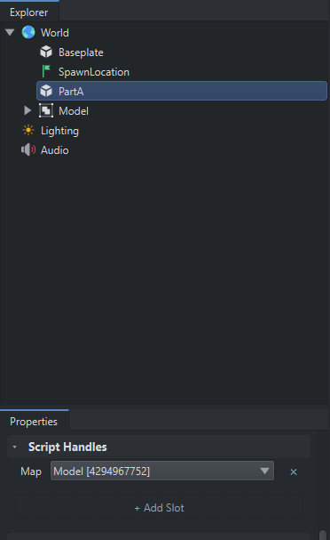

# Unofficial Luduvo Script docs

>[!WARNING]
> Everything documented here is **untested** and may not work in an actual script, most of this is inferring what i'm seeing from analysing the executable. 

Credits:

- @lua_u on discord for the [environment dumper script](https://github.com/luduvo-devhub/luduvo-scripting-docs/blob/main/EnvDumper.luau)
- @meowzers1/MeowzersDev
- @primiti_ve2/Primiti-ve
- @Uzixt

## Scripts
Scripts are attached to Instances.
within scripts, `self` points to the Instance that the script is attached to, the equivalent of doing `script.Parent` in roblox.

## Script Handles
Script Handles allow you to set references to other `Instances` via the Editor, which can then be accessed via scripts.



In this example above, we add a script handle component called `Map` onto partA, and we set the reference to `World.Model`. Scripts can access ScriptHandles of the Instance that they're attached to via the `handles` global.

In this example, inside a script attached to PartA:
```lua
print(handles.Map.Name) -- output: Model
```
This means that you can move/rename `World.Model` anywhere within your project, and you won't need to update your code everytime you do so.


## Lifetime Functions:
| function | ran |
|---|---|
| `Update(dt)` | every frame |
| `PhysicsUpdate(dt)` | every physics step, probably at a fixed frequency |

## Global Functions:
| function | notes |
|---|---|
| `tick()` |  returns a timestamp (seconds) |
| `typeof(x)` | Returns the luduvo type name of a value |

## Constructors
| call | return |
|---|---|
| `Color3(r,g,b)` | Returns a Vector3. |
| `Vector2(x, y)` | Returns a Vector3. | 

## Globals:
| global | notes |
|---|---|
| `handles` | the handles of the Instance the script is attached to |
| `self` | the Instance that the script is attached to |


## Types:
This may be incomplete.

### Vector3
#### Constructor
- `Vector3.new(x, y, z)`

#### Constants
- `Vector3.zero`
- `Vector3.one`
- `Vector3.xAxis`
- `Vector3.yAxis`
- `Vector3.zAxis`

#### Methods
- `v:Magnitude()`
- `v:Unit()`
- `v:Dot(v2)`
- `v:Cross(v2)`
- `v:Lerp(v2, t)`
#
### UDim2

`UDim2(xScale, xOffset, yScale, yOffset) `

#
### Instance
#### Constructor
- `Instance.new(className)`

Current creatable classes:
`Part`, `SpawnLocation`

Note: Instance's are automatically parented to the 3d world.

#### Methods
- `inst:Destroy()`
- `inst:FindFirstChild()`
- `inst:GetChildren()`
- `inst:IsDescendantOf()`

#### Properties:
For all Instances:
- `Name`
- `Parent`
- `ClassName`

For Part Instances:
- `Position`
- `Size`
- `Rotation`
- `Orientation`
- `Scale`
- `Anchored`
- `Velocity`

UI Instances:
- `Image`
- `ImageColor`
- `ImageTransparency`
- `SliceCenter`
- `CanvasSize`
- `CanvasPosition`
  
Misc:
- `NetworkID`
- `StableID`
- `RigidBody`
- `CharacterMoveIntent`
- `RemoteEntity`

#### Events

For user interface instances?
- `MouseButton1Click`
- `MouseButton1Down`
- `MouseButton1Up`
- `MouseEnter`
- `MouseLeave`
- `MouseWheel`
 

#### Example:
```lua
local part = Instance.new("Part")
part.Position = Vector3.new(0,30,0)
```
#
### Signal
`signal:Connect(callback)`

`sig:Disconnect()` or `sig:Wait` probably do exist but we can't test for it right now.
#
### Tween
You can only tween UI instances

Tween(Instance, Duration, EasyingStyle, properties)

styles:
- quad
- cubic
- sine
- exponential
- back
- bounce
- elastic