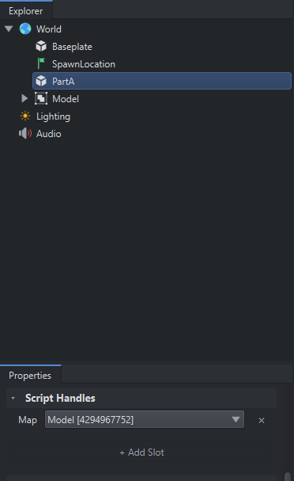

# Scripts & Script Handles

## Scripts

Unlike Roblox's implementation, scripts are not separate Instances. In Luduvo, scripts are attached to Instances. You can only have one script per Instance. This is independent of the script type; you can only have a Client or a Server script per Instance.

Within scripts, the `self` global points towards the Instance that the script is attached to. This is the equivalent of using `script.Parent` in roblox.

## Script Handles

Script Handles allow you to set references to other Instances via the `Properties` panel in Luduvo Studio.



The example shows adding a Script Handle named `Map` onto PartA. The reference is set to the `Model` model in the world. These can then be accessed via the `handles` global inside of scripts.

In this example, inside a script attached to PartA:

```lua
print(handles.Map.Name) -- output: Model
```